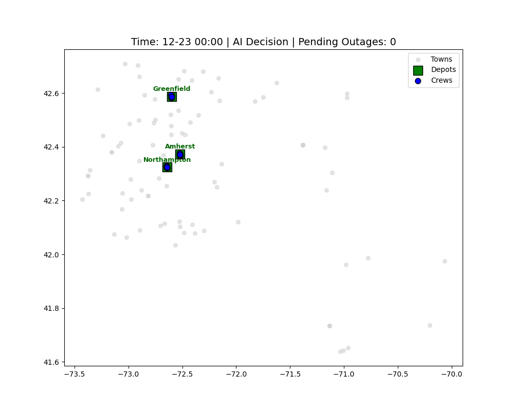

# ⚡ Reinforcement Learning for Power Grid Crew Dispatch


*Figure 1: Real-time visualization of the RL agent dispatching repair crews during the "Christmas Storm" of December 2022. Green squares are depots, blue dots are idle crews, orange dots are active crews, and red crosses are power outages.*

## 📖 Project Overview

Extreme weather events pose a significant threat to power grid reliability. Traditional crew dispatch is often reactive—sending crews only after an outage occurs. 

This project implements a **Deep Reinforcement Learning (DRL)** solution using **Proximal Policy Optimization (PPO)** to *proactively* position utility crews based on high-dimensional weather forecasts. The goal is to minimize the total outage duration (SAIDI) and operational costs by anticipating failures before they happen.

**Key Features:**
* **Custom Gym Environment:** Simulates realistic repair logic, travel times (Haversine distance), and crew availability constraints.
* **Real-World Data:** Trained on 10 years of outage data and weather forecasts from Western Massachusetts (100+ towns).
* **Proactive Strategy:** The agent learns to interpret probabilistic weather forecasts to preposition crews.
* **Hybrid Architecture:** Modular Python codebase for training/deployment + Jupyter Notebooks for data exploration (EDA).

## 🛠️ Tech Stack

* **Python 3.8+**
* **Reinforcement Learning:** Stable-Baselines3 (PPO), Gymnasium
* **Data Processing:** Pandas, NumPy
* **Geospatial:** Haversine
* **Visualization:** Matplotlib (Custom real-time animation)

## 📂 Project Structure

This project follows a production-ready directory structure, separating core logic from experimentation.

```text
power-grid-rl/
├── data/                        # Dataset storage
│   ├── outage_western_100.csv
│   └── (See note below for large files)
├── src/                         # Source code package
│   ├── config.py                # Configuration hyperparameters
│   ├── data_loader.py           # ETL and data preprocessing
│   ├── env.py                   # Custom Gym Environment & Crew Logic
│   └── utils.py                 # Geospatial helper functions
├── notebooks/                   # EDA and visualization experiments
├── train.py                     # CLI entry point for training/testing
├── requirements.txt             # Python dependencies
└── README.md                    # Project documentation
```


## 🛠️ Installation

1.  **Clone the repository:**
    ```bash
    git clone [https://github.com/your-username/power-grid-rl.git](https://github.com/haiyun101/outage_crew_dispatch.git)
    cd outage_crew_dispatch
    ```

2.  **Create a virtual environment (Recommended):**
    ```bash
    conda create -n green_energy python=3.9
    conda activate green_energy
    ```

3.  **Install dependencies:**
    ```bash
    pip install -r requirements.txt
    ```

## 🏃 How to Run

This project supports both a **Training Mode** (Full year simulation) and a **Test/Demo Mode** (Short high-impact storm scenario).

### 1. Quick Demo (The "Christmas Storm" Scenario)
To quickly verify the environment and see the agent in action during the 2022 Christmas Storm (Dec 22 - Dec 26):

```bash
python train.py --test    
```
* **Duration:** ~1-2 minutes.
* **Output:** Trains for a short period and saves a checkpoint ending in `_test.zip`.

### 2. Full Training
To train the PPO agent on the full dataset (2022-2023) for 500,000 timesteps:

```bash
python train.py
```
* **Duration:** ~1-2 hours (depending on CPU).
* **Output:** Saves the trained model as ppo_crew_dispatch_full.zip.

### 3. Custom Training Steps
You can specify the number of training steps via the command line:

```bash
python train.py --steps 100000
```
## 📊 Data & Large Files

This project utilizes three primary datasets:

1.  **Outage Records:** Historical outage data.
2.  **Spatial Features:** Coordinates and population density of towns.
3.  **Weather Forecasts:** Proactive outage probability signals.

> **⚠️ Important Note on Large Files:**
> The weather forecast file (`probability_forecasts_stdcl_2022.csv`) exceeds 100MB and is **not hosted directly on GitHub**.
>
> * **Option A:** The code includes robust handling; if the forecast file is missing, the simulation will run using historical outage data only (reactive mode).
> * **Option B:** To reproduce the full proactive results, please download the full dataset from [INSERT YOUR DROPBOX/DRIVE LINK HERE] and place it in the `data/` folder.

## 🔬 Methodology

### Observation Space
The agent observes a combined state vector:
* **Crew States:** Location (x, y), Status (Idle/Busy), Home Base coordinates.
* **Forecast Grid:** 8-hour lookahead outage probabilities for all towns.

### Action Space
* **MultiDiscrete:** Each of the 18 crews (6 per station) can choose to stay put or redeploy to any of the 100 towns.

### Reward Function
$$R_t = - \sum (\text{Outage Duration} \times \text{Population Density}) - \text{Travel Cost}$$
The agent is penalized heavily for leaving high-density areas without power.

<!--## 📈 Results

*(Optional: Add a screenshot of your Reward Curve or a table comparing Baseline vs. PPO performance here)*
-->

## 🤝 Contact

* **Author:** Haiyun Huang
* **Email:** haiyun.huang@tufts.edu
* **LinkedIn:** https://www.linkedin.com/in/haiyun-jasmine-huang/

---
*This project was developed as part of the CS138 Reinforcement Learning Course.*
